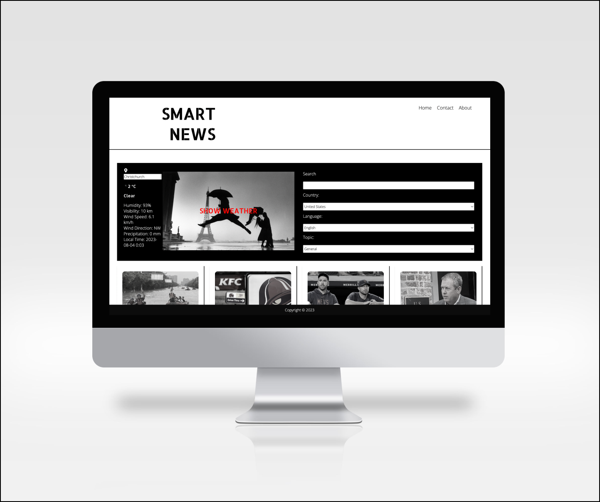

# Formative 3.1
## NewsAPI and WeatherApi App

**This web application relies on the [NewsAPI](https://newsapi.org) and [WeatherAPI](https://www.weatherapi.com) services. The website offers various exciting features, including weather updates from different cities worldwide, a collection of international news in multiple languages, and coverage of various topics such as General, Business, Entertainment, Health, Science, Sports, and Technology. It also includes an assortment of inspiring quotes and jokes by using for Quotes [Type Fit API](https://type.fit/api/quotes) and [Official Joke API](https://official-joke-api.appspot.com/).**

[MOCKUPS](https://www.figma.com/file/zucRiZQF1yfgl1GnJ6XiiT/Untitled?type=design&node-id=0%3A1&mode=design&t=HZ7TmIXRfLArGz1e-1)



## npm packages

:arrow_right: **react-router-dom**

*Provides routing capabilities for React applications, allowing navigation between different components and pages.*


:arrow_right: **react**

*The core library for building user interfaces in React applications. React allows developers to create reusable UI components and manage the state of these components efficiently.*

:arrow_right: **react-bootstrap-icons**

*This package provides a collection of Bootstrap icons as React components.
Imported icons, like List and X, are used in our  app to display visual elements such as close-button and icons.*


:arrow_right: **react-loader-spinner**

*This package is used to show a loading spinner while waiting for data to be fetched from the server or during operations.*


:arrow_right: **axios**

*It is used to send HTTP requests to fetch data from the server, for example, news articles, to display on the app.*

```javascript
const fetchNews = async () => {
      setLoading(true);
      try {
        // Make an API call using axios.get
        const response = await axios.get(
          `https://newsapi.org/v2/top-headlines?country=${country}&language=${language}&category=${topic}&q=${searchTerm}&apiKey=${apiKey}`
        );

        const articles = response.data.articles.map((article) => {
          return {
            ...article,
            onSelect: () => setSelectedArticle(article),
          };
        });

        // Set the fetched news articles and update the loading state
        setNews(articles);
        setLoading(false);
      } catch (error) {
        console.log(error);
      }
    };
    fetchNews();
  }, [country, language, topic, searchTerm, apiKey]);

  // ... (rest of the code)

  return (
    <div className="container">
      {/* ... (other JSX elements) */}
      <div className="loader">
        {loading ? (
          // Show a loading spinner when loading is true
          <Puff color="#00BFFF" height={100} width={100} />
        ) : news.length === 0 ? (
          // Show a message if no articles are found
          <p>No Articles Found</p>
        ) : (
          // Display the news articles using map function
          news.map((item) => (
            <div className="news-item" key={item.url}>
              {/* ... (other JSX elements for news items) */}
            </div>
          ))
        )}
      </div>
    </div>
  );
};

```
**axios.get is used to make a GET request to the NewsAPI service to fetch news articles based on the selected country, language, topic, and search term. The response data is then mapped to create an array of articles with additional onSelect function. Finally, the fetched news articles are stored in the news state, and the loading state is updated accordingly.**

### For our project, we utilize various tools such as VS Code, Terminal, Figma, and Chrome Dev.

*VS Code (Visual Studio Code) provides extensible platform for writing and editing code.*

*Terminal allows user to execute commands and navigate through the file system using text-based commands.*

*Figma provides a wide range of design and prototyping features, enabling designers to create their designs seamlessly. Figma allowed us to create mockups for our project.*

*Chrome DevTools allows us to inspect and debug web app, modify styles in real-time, and troubleshoot our web application.*

### Developed by Maria Stromova. 
:pouting_woman: **I am a student at Yoobee College, specializing in UX Design and Web Development.**

**In the realm of user experience (UX) design, I have learned the art of crafting interfaces that prioritize the needs and preferences of users. The digital products I create are not only visually appealing but also highly functional and enjoyable to use.**

**Web development is the backbone of my journey as a developer. I have delved into the world of programming languages such as HTML, CSS, JavaScript, and beyond. Additionally, I have explored frameworks and libraries like React, and Bootstrap to deliver more robust and efficient web solutions.**


